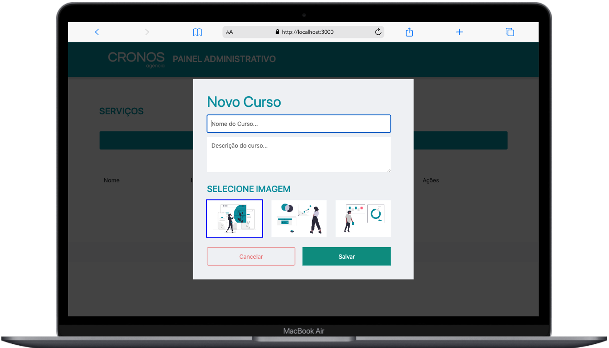

# Agência Cronos

  
   

---

## 💻 Tecnologias Utilizads

Durante o projeto, foram utilizadas as seguintes tecnologias: 
 - [JavaScript](https://developer.mozilla.org/pt-BR/docs/Web/JavaScript)
 - [UUIDV4](https://www.uuidtools.com/v4)
 - [CSS](https://www.w3.org/Style/CSS/)
 - [HTML](https://developer.mozilla.org/pt-BR/docs/Web/HTML)

 ## ☕ Sobre
Esse projeto foi desenvolvido durante a Semana 6 do Gama Experience #40, um projeto em trio. O Desafio principal tinha por objetivo construir CRUD em JavaScript. O HTML principal da página foi entregue pela equipe da Gama, e cada grupo precisou então construi um modal e funcionalidades para **criar, ler, atualizar e destruir** um curso. Utilizamod o **localStorage** para armazenar os dados.

- Pair programmim: Contruímos o projeto de forma conjunta através de um computador. Toda a lógica foi constrúida por todos os desenvolvedores mas a responsabilidade do commit ficou apenas com um.

## 💻 Funcionalidades:

- [x] Criar um modal responsivo e abri-lo ao clicar em "Adicionar novo",
- [x] Validar o preenchimento do formulário, capturar informações dos inputs, salvar no localStorage e limpar os campos do modal ao fechar,
- [x] Ler os cursos do localStorage e montar o HTML,
- [x] Botão com funcionalidade de editar para recuperação dos dados salvos para alteração e salvamento, com o mesmo modal, através de uma validação feita ao "salvar",
- [x] Botão com a funcionalidade de deletar, filtrando e excluindo o curso no localStorage através do ID.

## 🤝 Colaboradores

<table>
  <tr>
    <td align="center">
      <a href="https://github.com/Marcos-Ignacio">
         
        
          <b>Marcos Ignacio</b>
        
      </a>
    </td>
    <td align="center">
      <a href="https://github.com/wspietro">
         
        
          <b>Pietro Sera</b>
        
      </a>
    </td>
     <td align="center">
      <a href="https://github.com/thewillian">
         
        
          <b>Willian Monteiro</b>
        
      </a>
    </td>
  </tr>
</table>

 
 

